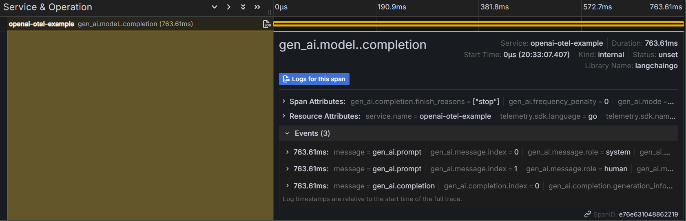

# Tracing LangChainGo OpenAI LLM calls with OpenTelemetry

Dive right into executing your first program utilizing LangChainGo in tandem with [OpenAI](https://openai.com/) and an OpenTelemetry backend.

## Pre-requisites

1. **OpenAI API Key**: Sign up on [OpenAI](https://openai.com/) and retrieve your API key.
2. **Go**: [Download and install Go](https://go.dev/doc/install).
3. **OpenTelemetry Backend (e.g., Grafana)**: Set up an OpenTelemetry backend to trace your LangChainGo LLM calls. Grafana offers a [free tier](https://grafana.com/auth/sign-up/create-user?plcmt=free) that you can use to get started.

## Steps

1. **Set up your OpenAI API Key**: Before interacting with the OpenAI API, ensure that you've set up your API key. Typically, this is done by setting an environment variable. In your terminal, run the command:
```shell
export OPENAI_API_KEY=your_openai_api_key_here
```

2. **Set up OpenTelemetry environment variables**: Set up the following environment variables to configure OpenTelemetry tracing:

```shell
export OTEL_SERVICE_NAME=openai-otel-example
export OTEL_EXPORTER_OTLP_PROTOCOL="http/protobuf"
export OTEL_EXPORTER_OTLP_ENDPOINT="https://otlp-gateway-prod-us-east-0.grafana.net/otlp"
export OTEL_EXPORTER_OTLP_HEADERS="Authorization=Basic <base64-encoded Grafana API token>"
```


2. **Run the Example:** Execute the following command:

```shell
go run github.com/tmc/langchaingo/examples/openai-opentelemetry-example@main
```

Anticipate an output similar to the one below:

```shell
"Bringing joy to your day, in every single way, our company shines bright, making everything just right!"Shut down otel SDK.
```

You will also see a trace in your OpenTelemetry backend, such as Grafana, that look like this:


The span's attributes will include the prompt and completion (can be turned off via options) and the model configuration as well as token usage (prompt, completion, and total tokens).

Congratulations! You've successfully built and executed your first LangChainGo LLM-backed program using OpenAI's cloud-based inference and tracing the calls with OpenTelemetry.


Here is the entire program (from [openai-opentelemetry-example](https://github.com/tmc/langchaingo/blob/main/examples/openai-opentelemetry-example/openai_chat_example.go)), comprising 2 files.

`openai_chat_example.go`:
```go
package main

import (
	"context"
	"errors"
	"fmt"
	"log"

	"github.com/joho/godotenv"
	"github.com/tmc/langchaingo/callbacks"
	"github.com/tmc/langchaingo/llms"
	"github.com/tmc/langchaingo/llms/openai"
	"go.opentelemetry.io/otel"
)

func main() {
	err := godotenv.Load()
	if err != nil {
		log.Fatal("Error loading .env file")
	}

	// 1. Setup OpenTelemetry SDK
	otelShutdown, err := setupOTelSDK(context.Background())
	if err != nil {
		log.Fatal(err)
	}
	defer func() {
		err = errors.Join(err, otelShutdown(context.Background()))
	}()

	// 2. Create a LangChain-Go CallbacksHandler for OpenTelemetry tracing
	h, err := callbacks.NewOpenTelemetryCallbacksHandler(otel.Tracer("langchaingo"), callbacks.WithLogPrompts(true), callbacks.WithLogCompletions(true))
	if err != nil {
		log.Fatal(err)
	}

	// 3. Pass the CallbackHandler in options when setting up the LangChain-Go OpenAI LLM
	llm, err := openai.New(openai.WithCallback(h))
	if err != nil {
		log.Fatal(err)
	}
	ctx := context.Background()

	content := []llms.MessageContent{
		llms.TextParts(llms.ChatMessageTypeSystem, "You are a company branding design wizard."),
		llms.TextParts(llms.ChatMessageTypeHuman, "What would be a good company jingle? Only provide the jingle."),
	}

	// 4. Use LLM instance as normal
	if _, err := llm.GenerateContent(ctx, content,
		llms.WithMaxTokens(1024),
		llms.WithStreamingFunc(func(ctx context.Context, chunk []byte) error {
			fmt.Print(string(chunk))
			return nil
		})); err != nil {
		log.Fatal(err)
	}
}
```

`setup_otel.go`:
```go
package main

import (
	"context"
	"errors"
	"fmt"
	"time"

	"go.opentelemetry.io/otel"
	"go.opentelemetry.io/otel/exporters/otlp/otlplog/otlploghttp"
	"go.opentelemetry.io/otel/exporters/otlp/otlpmetric/otlpmetrichttp"
	"go.opentelemetry.io/otel/exporters/otlp/otlptrace/otlptracehttp"
	"go.opentelemetry.io/otel/log/global"
	"go.opentelemetry.io/otel/propagation"
	"go.opentelemetry.io/otel/sdk/log"
	"go.opentelemetry.io/otel/sdk/metric"
	"go.opentelemetry.io/otel/sdk/trace"
)

func newSpanExporter(ctx context.Context) (trace.SpanExporter, error) {
	return otlptracehttp.New(ctx)
}

func newMetricExporter(ctx context.Context) (metric.Exporter, error) {
	return otlpmetrichttp.New(ctx)
}

// setupOTelSDK bootstraps the OpenTelemetry pipeline.
// If it does not return an error, make sure to call shutdown for proper cleanup.
func setupOTelSDK(ctx context.Context) (shutdown func(context.Context) error, err error) {
	var shutdownFuncs []func(context.Context) error

	// shutdown calls cleanup functions registered via shutdownFuncs.
	// The errors from the calls are joined.
	// Each registered cleanup will be invoked once.
	shutdown = func(ctx context.Context) error {
		var err error
		for _, fn := range shutdownFuncs {
			err = errors.Join(err, fn(ctx))
		}
		shutdownFuncs = nil
		return err
	}

	// handleErr calls shutdown for cleanup and makes sure that all errors are returned.
	handleErr := func(inErr error) {
		err = errors.Join(inErr, shutdown(ctx))
	}

	// Set up propagator.
	prop := newPropagator()
	otel.SetTextMapPropagator(prop)

	// Set up trace provider.
	tracerProvider, err := newTraceProvider()
	if err != nil {
		handleErr(err)
		return
	}
	shutdownFuncs = append(shutdownFuncs, tracerProvider.Shutdown)
	otel.SetTracerProvider(tracerProvider)

	// Set up meter provider.
	meterProvider, err := newMeterProvider()
	if err != nil {
		handleErr(err)
		return
	}
	shutdownFuncs = append(shutdownFuncs, meterProvider.Shutdown)
	otel.SetMeterProvider(meterProvider)

	// Set up logger provider.
	loggerProvider, err := newLoggerProvider()
	if err != nil {
		handleErr(err)
		return
	}
	shutdownFuncs = append(shutdownFuncs, loggerProvider.Shutdown)
	shutdownFuncs = append(shutdownFuncs, func(context.Context) error {
		fmt.Println("Shut down otel SDK.")
		return nil
	})
	global.SetLoggerProvider(loggerProvider)

	return
}

func newPropagator() propagation.TextMapPropagator {
	return propagation.NewCompositeTextMapPropagator(
		propagation.TraceContext{},
		propagation.Baggage{},
	)
}

func newTraceProvider() (*trace.TracerProvider, error) {
	traceExporter, err := newSpanExporter(context.Background())
	if err != nil {
		return nil, err
	}

	traceProvider := trace.NewTracerProvider(
		trace.WithBatcher(traceExporter,
			// Default is 5s. Set to 1s for demonstrative purposes.
			trace.WithBatchTimeout(time.Second)),
	)
	return traceProvider, nil
}

func newMeterProvider() (*metric.MeterProvider, error) {
	metricExporter, err := newMetricExporter(context.Background())
	if err != nil {
		return nil, err
	}

	meterProvider := metric.NewMeterProvider(
		metric.WithReader(metric.NewPeriodicReader(metricExporter,
			// Default is 1m. Set to 3s for demonstrative purposes.
			metric.WithInterval(3*time.Second))),
	)
	return meterProvider, nil
}

func newLoggerProvider() (*log.LoggerProvider, error) {
	logExporter, err := otlploghttp.New(context.Background())
	if err != nil {
		return nil, err
	}

	loggerProvider := log.NewLoggerProvider(
		log.WithProcessor(log.NewBatchProcessor(logExporter)),
	)
	return loggerProvider, nil
}
```

